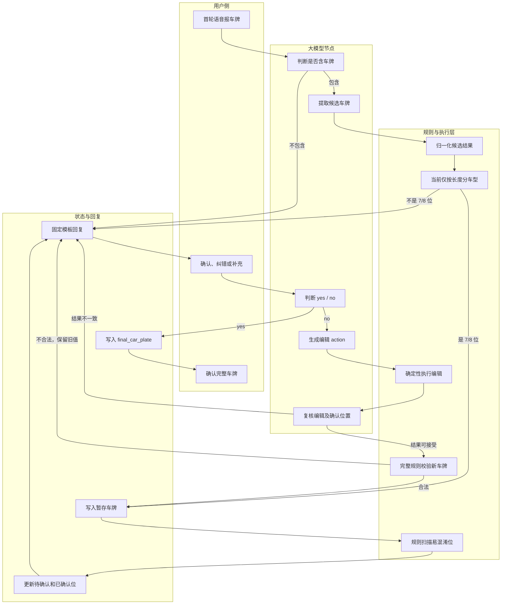
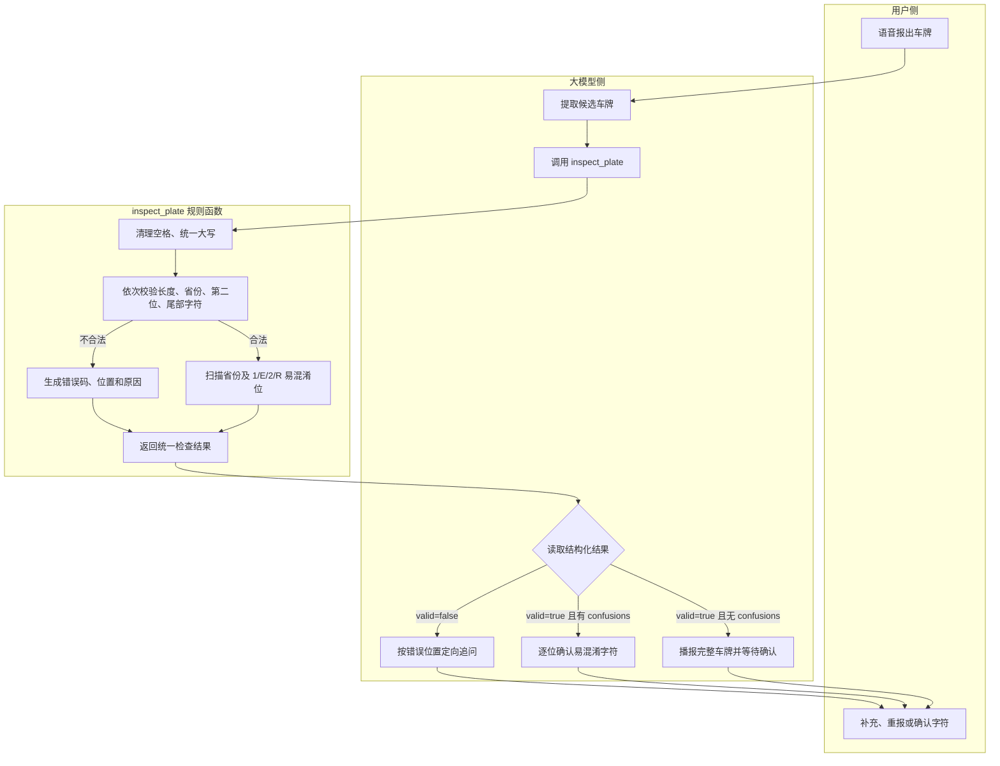
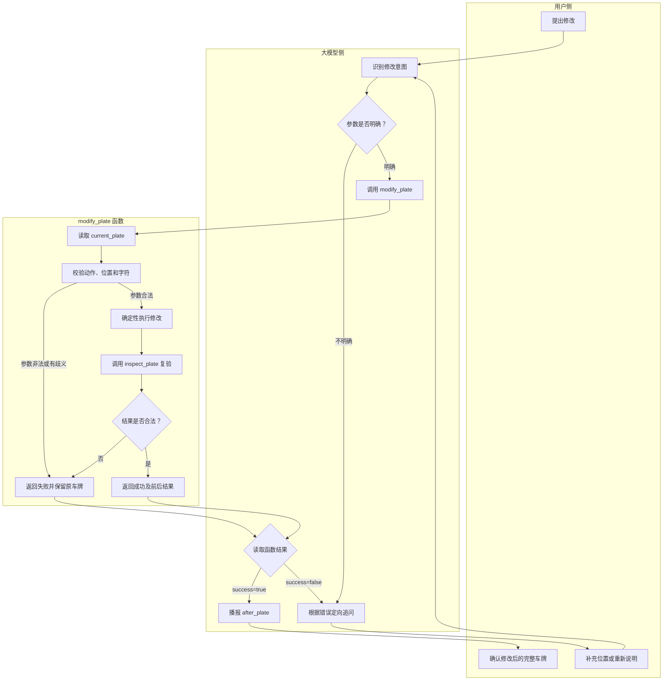
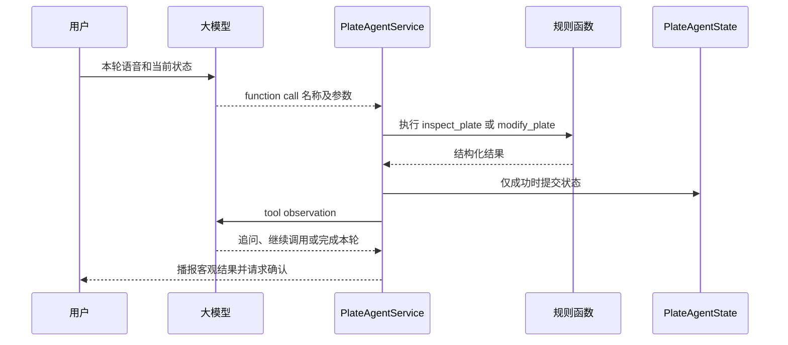

# 车牌规则函数嵌入 Agent 流程汇报

> 代码依据：本次更新的 `services(4).zip`。  
> 汇报目标：按照上级提出的方案，把“车牌合理性判断”和“车牌修改”交给两个确定性函数，大模型只负责理解用户语音、生成函数参数和组织回复，从而减少车牌规则判断、字符定位及修改过程中的幻觉。

## 一、结论先行

本次新代码已经完成了“规则能力”和“编辑能力”的基础拆分：

- `plate_agent_rules.py` 已实现车牌归一化、完整格式校验和易混淆字符扫描；
- `plate_agent_edit.py` 已实现按位置替换、按字符替换、插入、删除和批量顺序执行；
- `plate_agent.py` 与 `plate_agent_nodes.py` 已形成“模型理解用户语音 → 输出 action → 后端确定性执行 → 模型复核 → 更新状态”的流程；
- `plate_agent_state.py` 与 `plate_agent_confirmation.py` 已维护当前车牌、逐位状态、待确认字符、已确认字符和最终车牌。

但当前实现还没有完全达到“两个函数作为标准 Function Call 工具嵌入 Pipeline”的目标，主要差距有四点：

1. 首轮识别后，主流程只调用 `vehicle_type_by_length()` 判断 7/8 位，没有调用完整规则函数 `is_valid_plate_number()`；因此“长度正确但省份、第二位或尾部字符不合法”的候选车牌仍可能写入暂存状态。
2. `is_valid_plate_number()` 只返回 `True/False`，没有返回不合法的具体规则、错误位置和建议下一步。
3. 编辑链路已经由后端函数确定性执行，但目前是模型按 Prompt 输出 action JSON，后端直接解析；代码兼容 `tool_calls/function_call` 形状，却没有看到模型请求侧注册原生工具 Schema，也没有统一的工具 observation 闭环。
4. 编辑动作执行后仍要由大模型输出 `valid_result` 做 ReAct 复核。完整车牌格式最终有规则函数兜底，但“动作是否正确”仍部分依赖模型二次判断。

因此，本轮建议不是推翻当前代码，而是在现有模块上增加两个上层工具：

| 上层工具 | 基于现有代码 | 职责 | 状态处理 |
| --- | --- | --- | --- |
| `inspect_plate` | `plate_agent_rules.py` | 标准化、完整规则校验、返回具体错误、扫描易混淆位 | 只读，不直接修改状态 |
| `modify_plate` | `plate_agent_edit.py` + `inspect_plate` | 确定性执行替换、插入、删除或完整重报，并复验结果 | 成功后才允许外层原子提交 |

最终职责边界：

- 大模型负责“听懂”：识别用户是确认、替换、插入、删除还是完整重报，并生成结构化参数；
- 函数负责“裁决”：车牌是否合法、错误发生在哪一位、按哪个位置修改、修改结果是否合法；
- 后端负责“状态”：只有函数成功后才更新暂存车牌，修改失败必须保留旧车牌；
- 用户负责“最终确认”：规则合法只代表格式正确，不代表用户已经确认。

---

## 二、新代码中的实际流程

### 2.1 当前总体流程图（As-Is）



### 2.2 当前一轮音频的真实执行顺序

#### 首轮：还没有暂存车牌

1. `handle_audio_turn()` 克隆旧状态，在 `working` 上处理，避免中途失败污染调用方状态。
2. `detect_plate_presence()` 调用音频模型，只返回 `true/false`。
3. `extract_car_plate()` 调用音频模型提取候选车牌。
4. `normalize_plate_result()` 清理格式；若首位是 ASCII 字母或数字，再调用模型重识别省份；首位 `G` 会被固定转换为“冀”。
5. `vehicle_type_by_length()` 只按长度判断：
   - 7 位：`fuel`；
   - 8 位：`new_energy`；
   - 其他：`unknown`。
6. 只要长度为 7/8 位，当前主流程就调用 `refresh_plate_state()` 写入暂存车牌。
7. `detect_initial_confusions_by_rule()` 扫描省份和 `1/E/2/R` 易混淆位。
8. 使用固定模板向用户播报识别结果，并要求继续确认。

#### 多轮：已有暂存车牌

1. `detect_confirmation()` 先让模型判断用户本轮是否在确认完整车牌，只输出 `yes/no`。
2. 如果为 `yes`，执行 `confirm_all`，写入 `final_car_plate`。
3. 如果为 `no`，进入 `update_car_plate()`：
   - 模型输出一个或多个编辑 action；
   - `parse_plate_edit_commands()` 解析 action；
   - `apply_plate_edit_commands()` 确定性执行；
   - `review_plate_update()` 再让模型判断动作是否覆盖用户意图；
   - 最多重复 3 个 ReAct 步骤。
4. 编辑结果调用 `is_valid_plate_number()` 做完整规则校验。
5. 合法才刷新暂存车牌；不合法则保留原车牌。
6. 再次扫描易混淆位，并更新待确认、已确认列表。

---

# 第一部分：识别车牌号是否合理

## 三、目标流程图（To-Be）



核心变化是：大模型不再自行判断“合理还是不合理”，而是必须读取 `inspect_plate` 的客观返回结果。大模型只负责把具体错误转换成自然语言追问。

## 四、当前规则函数已经实现什么

`plate_agent_rules.py` 中已有完整布尔校验函数：

```python
def is_valid_plate_number(car_plate: str) -> bool:
    ...
```

它实际检查以下规则：

1. 清理空格并统一为大写；
2. 车牌长度必须为 7 位或 8 位；
3. 第 1 位必须属于合法省份简称集合；
4. 第 2 位必须是 `A-Z`；
5. 第 3 位以后通常只能是 `A-Z` 或 `0-9`；
6. `警、临、学、领、挂` 可以出现，但只能在最后一位；
7. 7 位标记为普通燃油车，8 位标记为新能源车；
8. 首位 `G` 会被归一化为“冀”。

当前易混淆扫描规则为：

- 省份简称：`甘、赣、津、京、桂、贵、冀、吉`；
- 字母数字：`2、R、1、E`。

易混淆字符不代表车牌不合法，只表示该位置需要用户二次确认。

### 4.1 当前首轮流程的关键问题

当前 `plate_agent.py` 首轮逻辑使用的是：

```python
vehicle_type = vehicle_type_by_length(car_plate)
if vehicle_type == "unknown":
    # 判为无效
```

也就是说，首轮只检查长度，而不是调用 `is_valid_plate_number()`。例如：

| 候选结果 | 长度判断 | 完整规则判断 | 当前首轮风险 |
| --- | --- | --- | --- |
| `京112345` | 7 位，通过 | 第 2 位不是字母，不通过 | 可能写入暂存状态 |
| `A123456` | 7 位，通过 | 第 1 位不是省份，不通过 | 可能写入暂存状态 |
| `京A1警345` | 7 位，通过 | “警”不在末位，不通过 | 可能写入暂存状态 |
| `京A12345` | 7 位，通过 | 通过 | 正常 |

因此，函数 1 的第一优先级不是重新写一套规则，而是把现有完整规则真正接入首轮入口，并扩展为可解释返回。

## 五、函数 1：`inspect_plate`

### 5.1 建议接口

```python
def inspect_plate(car_plate: str) -> dict:
    """
    对候选车牌进行只读检查。

    输入：
        car_plate: 模型从用户音频中提取的候选车牌。

    输出：
        标准化车牌、是否合法、车辆类型、错误明细、
        易混淆位置以及建议的下一步。
    """
```

### 5.2 建议返回结构

合法但有易混淆字符：

```json
{
  "success": true,
  "normalized_plate": "京A12E45",
  "valid": true,
  "plate_length": 7,
  "vehicle_type": "fuel",
  "errors": [],
  "confusions": [
    {
      "position": 1,
      "value": "京",
      "reason": "第1位当前识别为北京的京，请用户确认是否正确"
    },
    {
      "position": 3,
      "value": "1",
      "reason": "第3位当前识别为数字1，请用户确认是否正确"
    },
    {
      "position": 4,
      "value": "2",
      "reason": "第4位当前识别为数字2，请用户确认是否正确"
    },
    {
      "position": 5,
      "value": "E",
      "reason": "第5位当前识别为字母E，请用户确认是否正确"
    }
  ],
  "recommended_next_action": "confirm_confusions"
}
```

不合法：

```json
{
  "success": true,
  "normalized_plate": "京112345",
  "valid": false,
  "plate_length": 7,
  "vehicle_type": "fuel",
  "errors": [
    {
      "code": "INVALID_SECOND_CHAR",
      "position": 2,
      "value": "1",
      "reason": "第2位必须是大写英文字母"
    }
  ],
  "confusions": [],
  "recommended_next_action": "ask_second_char"
}
```

### 5.3 建议错误码

| 错误码 | 客观含义 | Agent 可生成的追问 |
| --- | --- | --- |
| `EMPTY_PLATE` | 没有候选字符 | “没有听清车牌，请完整再说一遍。” |
| `INVALID_LENGTH` | 不是 7/8 位 | “目前识别到 6 位，请完整重报车牌。” |
| `INVALID_PROVINCE` | 第 1 位不是合法省份简称 | “请重新说一下第 1 位省份简称。” |
| `INVALID_SECOND_CHAR` | 第 2 位不是英文字母 | “请确认第 2 位英文字母。” |
| `INVALID_BODY_CHAR` | 第 3 位以后出现非法字符 | “第 5 位没有识别为字母或数字，请再说一次。” |
| `SPECIAL_CHAR_NOT_AT_TAIL` | 特殊字符出现在非末位 | “特殊字符只能位于最后一位，请重新确认。” |

### 5.4 接入位置

首轮应从：

```text
提取候选车牌 → 按长度分车型 → 写入状态
```

改为：

```text
提取候选车牌 → inspect_plate → valid=true 才写入状态
```

同时建议在最终确认前再调用一次 `inspect_plate`，形成双保险：

```text
用户明确确认 → inspect_plate(当前暂存车牌) → 合法才写 final_car_plate
```

### 5.5 合法不等于已经确认

| `inspect_plate` 结果 | Agent 下一步 |
| --- | --- |
| `valid=false` | 根据 `errors` 定向追问，不写入新状态 |
| `valid=true` 且 `confusions` 非空 | 写入暂存车牌，逐位确认易混淆字符 |
| `valid=true` 且 `confusions` 为空 | 播报完整车牌，等待用户确认 |
| 用户下一轮明确确认且再次校验合法 | 写入 `final_car_plate` |

---

# 第二部分：修改车牌号

## 六、当前编辑链路已经实现什么

当前 `plate_agent_edit.py` 已把字符串修改做成确定性函数，不再让大模型直接生成修改后的完整车牌。

支持的模型动作：

| Action | 含义 | 主要参数 |
| --- | --- | --- |
| `replace_position` | 按第几位替换一个字符 | `position`, `value` |
| `replace_char` | 按已有字符替换 | `old_value`, `value`, `occurrence` |
| `insert_position` | 在某一位前后插入 | `position`, `value`, `relation` |
| `delete_position` | 删除第几位 | `position` |
| `none` | 用户只是确认或没有明确修改 | 无 |

现有函数已经具备以下防护：

- 对外位置从 1 开始，内部执行时再转换为 Python 下标；
- 替换和删除会检查位置范围；
- `normalize_edit_value()` 只接受归一化后的单字符；
- 支持口语字符转换，例如“洞→0、幺→1、拐→7、吸→C、勾→J、圈→Q”；
- 按字符替换时，如果原字符不存在，会返回“未找到”；
- 同一个字符出现多次且没有说明 `first/last/all` 时，会拒绝猜测；
- 支持同一轮多个 action 按顺序执行；
- 编辑后会调用 `is_valid_plate_number()` 复验完整车牌。

### 6.1 当前链路仍依赖模型的部分

当前 `update_car_plate()` 每一步为：

```text
模型生成 action
→ 函数执行 action
→ 模型 review
→ 规则函数复验新车牌
```

其中模型 review 输出：

- `confirmed_positions`；
- `needs_more_edit`；
- `valid_result`；
- `reason`。

因此目前已经解决“让模型自己计算第几位修改后的字符串”的主要风险，但仍存在两类模型依赖：

1. action 参数可能识别错，例如把第 4 位听成第 5 位；
2. `valid_result` 仍由模型生成，可能错误拒绝一个实际正确的编辑动作。

完整格式由 `is_valid_plate_number()` 兜底，所以模型无法把格式不合法的新车牌正式写入；但动作意图是否匹配，仍需要 review 或用户再次确认。

## 七、目标修改流程图（To-Be）



## 八、函数 2：`modify_plate`

### 8.1 建议接口

```python
def modify_plate(
    current_plate: str,
    action: str,
    position: int = 0,
    value: str = "",
    old_value: str = "",
    relation: str = "before",
    occurrence: str = "",
) -> dict:
    """
    确定性修改当前车牌，并调用 inspect_plate 复验。
    所有对外 position 均从 1 开始。
    """
```

为支持用户完整重报，可在现有 action 基础上新增：

```text
set_plate：用户明确说出新的完整车牌时，直接把完整候选值交给
inspect_plate 校验，不让模型拆成多次局部替换。
```

这样仍然只向大模型暴露两个上层工具，不需要增加第三个工具。

### 8.2 建议返回结构

成功：

```json
{
  "success": true,
  "action": "replace_position",
  "before_plate": "京A12E45",
  "after_plate": "京A12145",
  "position": 5,
  "changed_positions": [5],
  "validation": {
    "valid": true,
    "errors": [],
    "confusions": [
      {
        "position": 3,
        "value": "1",
        "reason": "第3位当前识别为数字1，请用户确认是否正确"
      },
      {
        "position": 5,
        "value": "1",
        "reason": "第5位当前识别为数字1，请用户确认是否正确"
      }
    ]
  },
  "error": null
}
```

失败：

```json
{
  "success": false,
  "action": "delete_position",
  "before_plate": "京A12345",
  "after_plate": "京A12345",
  "position": 3,
  "changed_positions": [],
  "validation": {
    "valid": false,
    "errors": [
      {
        "code": "INVALID_LENGTH",
        "reason": "删除后只剩6位"
      }
    ]
  },
  "error": {
    "code": "INVALID_AFTER_EDIT",
    "message": "修改结果不符合车牌规则，已保留原车牌"
  }
}
```

### 8.3 必须保留的后端硬约束

1. 所有位置参数统一使用 1-based。
2. `value` 必须归一化为一个字符，不能由模型传入多字符完成局部修改。
3. 替换和删除必须检查范围。
4. 按字符替换遇到重复字符时，不允许模型默认选择某一个。
5. 修改后必须调用 `inspect_plate`，不能只检查长度。
6. 修改失败时，`after_plate` 必须等于 `before_plate`。
7. 外层只有在 `success=true` 时才调用 `refresh_plate_state()`。
8. 修改成功后只更新暂存车牌，不在同一轮写入 `final_car_plate`。
9. 用户必须在下一轮确认播报后的完整车牌。
10. 多动作最好作为一个原子事务执行：任何一步失败，都回滚到修改前车牌，避免半成功状态。

第 10 点是对当前批量顺序执行的进一步收紧。当前代码在多个 action 中后续动作失败时，可能保留前面已经完成的暂定结果；上层 `modify_plate` 应明确选择“整体成功才提交”。

---

## 九、Function Call 如何嵌入当前 Pipeline

### 9.1 当前实现与标准 Function Calling 的区别

当前代码的实际方式是：

1. Prompt 告诉模型可输出哪些 action；
2. 模型在最终文本中输出 JSON；
3. `parse_plate_edit_commands()` 提取最后一个 JSON；
4. 后端调用 `apply_plate_edit_commands()`；
5. 再把执行结果放入下一次 review Prompt 的上下文。

解析器能够兼容以下结构：

- 直接 action JSON；
- `actions` 列表；
- `tool_calls[].function.arguments`；
- `function_call.arguments`。

这表示“返回格式兼容 Function Call”，但不等于已经使用模型接口的原生 Function Calling。当前压缩包中没有原稿提到的 `plate_agent_tooling.py`，`ChatModel.complete_audio()` 也没有 `tools/tool_choice` 参数，而且 `audio_call()` 每次传入的 `history=[]`。

`plate_agent_logging.py` 会把部分日志整理成 `assistant.tool_calls` 和 `role=tool` 的形状，便于调试和回放；但这些是日志记录，不是注册给模型的真实工具，也没有作为工具 observation 注入下一次模型调用。

### 9.2 目标调用闭环



### 9.3 建议工具 Schema

`inspect_plate`：

```json
{
  "name": "inspect_plate",
  "description": "按确定性规则检查候选车牌是否合法，并返回错误位置和易混淆位置",
  "parameters": {
    "type": "object",
    "properties": {
      "car_plate": {
        "type": "string",
        "description": "从用户语音提取出的完整候选车牌"
      }
    },
    "required": ["car_plate"],
    "additionalProperties": false
  }
}
```

`modify_plate`：

```json
{
  "name": "modify_plate",
  "description": "根据明确动作修改当前暂存车牌，位置从1开始，并自动复验",
  "parameters": {
    "type": "object",
    "properties": {
      "current_plate": {"type": "string"},
      "action": {
        "type": "string",
        "enum": [
          "replace_position",
          "replace_char",
          "insert_position",
          "delete_position",
          "set_plate"
        ]
      },
      "position": {"type": "integer", "minimum": 1},
      "value": {"type": "string"},
      "old_value": {"type": "string"},
      "relation": {
        "type": "string",
        "enum": ["before", "after"]
      },
      "occurrence": {
        "type": "string",
        "enum": ["first", "last", "all"]
      }
    },
    "required": ["current_plate", "action"],
    "additionalProperties": false
  }
}
```

Schema 只能约束参数形状，不能替代 Python 后端的范围、字符、歧义和完整车牌规则校验。

### 9.4 调用示例

模型识别到首轮车牌后：

```json
{
  "name": "inspect_plate",
  "arguments": {
    "car_plate": "京A12E45"
  }
}
```

用户说“第 5 位不是字母 E，是数字 1”后：

```json
{
  "name": "modify_plate",
  "arguments": {
    "current_plate": "京A12E45",
    "action": "replace_position",
    "position": 5,
    "value": "1"
  }
}
```

函数执行结果作为 observation 返回模型：

```json
{
  "success": true,
  "before_plate": "京A12E45",
  "after_plate": "京A12145",
  "changed_positions": [5],
  "validation": {
    "valid": true,
    "errors": []
  }
}
```

大模型下一步不再重新计算字符串，只能基于 `after_plate` 组织回复：

```text
已按您的说明更新为京A12145，请确认完整车牌是否正确。
```

---

## 十、代码文件与目标方案的对应关系

| 新代码文件 | 当前职责 | 目标改造 |
| --- | --- | --- |
| `chatbox_application.py` | 接收音频、读取和保存 Session 状态、保存轮次摘要 | 保留，提交 Agent 返回的新状态 |
| `plate_agent.py` | 首轮/多轮总编排 | 首轮和最终确认前接入 `inspect_plate` |
| `plate_agent_nodes.py` | 模型调用节点、编辑 ReAct、编辑复核 | 把编辑执行收敛为 `modify_plate` 调用，并回传 observation |
| `plate_agent_rules.py` | 布尔合法性、车型、归一化、易混淆扫描 | 新增可解释的 `inspect_plate` |
| `plate_agent_edit.py` | 解析 action、执行替换/插入/删除 | 作为 `modify_plate` 的底层纯函数 |
| `plate_agent_confirmation.py` | 更新待确认和已确认位置 | 继续根据函数返回的 `confusions` 更新确认状态 |
| `plate_agent_state.py` | 克隆、刷新和维护逐位状态 | 只在工具成功后原子提交 |
| `plate_agent_types.py` | Agent、字符、编辑和 review 数据结构 | 增加检查错误和统一工具结果类型 |
| `plate_agent_prompts.py` | 引导模型输出 action 和 review JSON | 改为两个工具的调用规则，减少模型自由输出 |
| `plate_agent_messages.py` | 固定业务话术 | 根据错误码选择定向追问模板 |
| `plate_agent_logging.py` | 节点、状态和耗时日志 | 增加函数输入、输出、错误码和提交结果日志 |

需要从原汇报稿中删除的旧描述：

- 本次压缩包中没有 `plate_agent_tooling.py`；
- 当前不是“最多 8 次统一 Agent 工具循环”，编辑 ReAct 实际最多 3 步；
- 当前执行结果是通过 review Prompt 上下文回填；日志虽然会记录成 `role=tool` 形状，但不是注入模型历史的统一工具消息闭环；
- 当前首轮还没有完整规则校验，不能表述为“候选车牌合法后才写入状态”。

---

## 十一、建议落地顺序

### P0：先修正首轮规则入口

1. 在 `plate_agent_rules.py` 新增 `inspect_plate()`；
2. 复用现有 `is_valid_plate_number()` 的规则，补充错误码、位置和原因；
3. 在 `plate_agent.py` 首轮写状态前调用；
4. 最终 `confirm_all` 前再次调用；
5. 不合法时保留空状态或旧状态，并按错误位置追问。

这是最重要的一步，因为当前首轮只校验长度。

### P1：封装统一修改工具

1. 用 `modify_plate()` 包装 `apply_plate_edit_command(s)`；
2. 在函数内部调用 `inspect_plate()` 复验；
3. 统一返回 `before_plate`、`after_plate`、`changed_positions`、`validation` 和 `error`；
4. 多 action 改为整体成功才提交；
5. 新增 `set_plate` 支持用户完整重报。

### P2：接入 Function Call

1. 在模型请求侧注册两个工具 Schema；
2. 模型只生成函数名称和参数；
3. 后端执行后把结果作为 tool observation 回传；
4. 大模型必须以 observation 为事实来源；
5. 保留最多 3 步的循环上限，防止无限调用。

如果当前模型服务暂时不支持原生工具参数，也可以先保留现有 JSON Prompt 方案，但后端接口和返回结构应先统一成两个工具。

### P3：降低模型 review 权限

模型 review 可以继续判断“用户意图是否覆盖”和“是否还有未处理修改”，但不能覆盖规则函数的事实：

- 不能把 `inspect_plate.valid=false` 改成合法；
- 不能自行改变 `after_plate`；
- 不能修改函数返回的实际位置；
- 不能在编辑成功的同一轮直接完成最终确认。

---

## 十二、测试用例

### 12.1 `inspect_plate` 单元测试

| 测试场景 | 输入 | 预期 |
| --- | --- | --- |
| 合法普通车牌 | `京A12345` | `valid=true`, `fuel` |
| 合法新能源车牌 | 合法 8 位车牌 | `valid=true`, `new_energy` |
| 空输入 | 空字符串 | `EMPTY_PLATE` |
| 长度错误 | 6 位或 9 位 | `INVALID_LENGTH` |
| 省份错误 | `A123456` | `INVALID_PROVINCE`, position=1 |
| 第二位错误 | `京112345` | `INVALID_SECOND_CHAR`, position=2 |
| 主体非法字符 | 第 3 位以后含非法汉字 | `INVALID_BODY_CHAR` |
| 特殊字符位置错误 | `京A1警345` | `SPECIAL_CHAR_NOT_AT_TAIL` |
| 合法但易混淆 | `京A12E45` | `valid=true` 且返回相应 confusions |
| G 归一化 | `GA12345` | 当前规则会变为 `冀A12345`，需业务确认 |

### 12.2 `modify_plate` 单元测试

| 测试场景 | 输入动作 | 预期 |
| --- | --- | --- |
| 按位置替换 | 第 5 位 `E→1` | 返回正确 `after_plate` |
| 替换越界 | 修改第 9 位 | 失败，保留原车牌 |
| 多字符 value | `value="AB"` | 参数失败 |
| 按字符未找到 | 把不存在的 `R` 改成 `2` | 返回未找到 |
| 重复字符未定位 | 多个 `1`，未指定 occurrence | 返回歧义，不猜位置 |
| 插入后合法 | 在明确位置插入一位形成合法车牌 | 成功 |
| 插入后超长 | 8 位车牌继续插入 | `INVALID_AFTER_EDIT` |
| 删除后过短 | 7 位车牌删除一位 | `INVALID_AFTER_EDIT` |
| 特殊字符改到中间 | 生成非尾部“警” | `INVALID_AFTER_EDIT` |
| 多 action 中一步失败 | 前一步成功、后一步失败 | 整体回滚 |
| 完整重报 | `set_plate` 新车牌 | 先检查，合法才返回成功 |

### 12.3 端到端对话测试

1. 合法但带 `1/E/2/R` 的首轮车牌；
2. 长度正确但省份不合法的首轮车牌；
3. 用户明确说“第 N 位改成 X”；
4. 用户只说“把 1 改成 E”，但车牌中有多个 1；
5. 用户一次说两个修改动作；
6. 用户确认其中一位，但没有确认整车牌；
7. 修改成功后，模型尝试同轮结束；
8. 用户完整重报另一张车牌；
9. 模型输出越界位置；
10. 模型 review 与规则函数结果冲突。

---

## 十三、评估指标

建议用同一批真实语音对比修改前后的 Pipeline：

| 指标 | 目的 |
| --- | --- |
| 首轮非法车牌误放行率 | 验证完整规则是否真正接入 |
| 不合法原因定位准确率 | 验证错误码和位置是否正确 |
| 编辑 action 参数准确率 | 衡量模型理解替换、插入、删除的能力 |
| 修改位置正确率 | 验证 1-based 位置和实际结果 |
| 修改后非法结果拦截率 | 验证复验兜底 |
| 修改失败时旧状态保留率 | 验证原子性 |
| 易混淆字符确认覆盖率 | 验证 `1/E/2/R` 等规则 |
| 修改后同轮误确认率 | 验证最终确认约束 |
| 平均交互轮数 | 衡量用户成本 |
| 最终车牌准确率 | 衡量整体效果 |
| 单轮模型调用次数和耗时 | 衡量 ReAct/review 带来的延迟 |

---

## 十四、风险与需要上级确认的规则

### 14.1 首位 `G → 冀`

当前 `replace_leading_g_with_ji()` 会无条件把首位字母 `G` 转成“冀”。这是一条业务纠错假设，不是通用车牌格式规则。

建议确认：

- 是否仅在音频识别场景使用；
- 是否需要模型重识别或用户确认后再转换；
- 是否放入可配置映射，而不是写死。

### 14.2 规则“合法”与真实车牌“正确”不同

规则函数只能判断格式是否满足约束，不能保证 ASR/多模态模型把用户说的字符听对。因此即使 `valid=true`，仍必须：

- 确认易混淆位；
- 向用户播报完整车牌；
- 等待用户最终确认。

### 14.3 模型 review 不能覆盖规则事实

模型可以判断用户意图是否被 action 覆盖，但规则结果必须拥有更高优先级。若二者冲突，应记录冲突并以函数结果为准。

---

## 十五、汇报总结

新代码已经把车牌规则、编辑动作、确认状态和主流程拆分到不同模块，也已经做到“模型输出编辑 action，Python 函数确定性修改字符串”。这比完全依靠大模型生成修改后车牌更稳定。

下一步应把现有能力收敛为两个上层工具：

1. `inspect_plate`：统一完成标准化、完整规则判断、具体错误定位和易混淆扫描；
2. `modify_plate`：统一完成参数校验、确定性修改、修改后复验和失败回滚。

最优先需要修正的是首轮入口：当前只按 7/8 位判断车型，没有调用完整合法性规则。完成两个上层函数后，再接入原生 Function Call 或现有 JSON 兼容调用，使大模型只负责生成参数和回复，不再负责车牌规则裁决及字符串位置计算。

一句话概括本方案：

> **大模型负责理解和表达，规则函数负责计算和裁决，后端状态层负责提交和回滚，最终结果由用户确认。**
